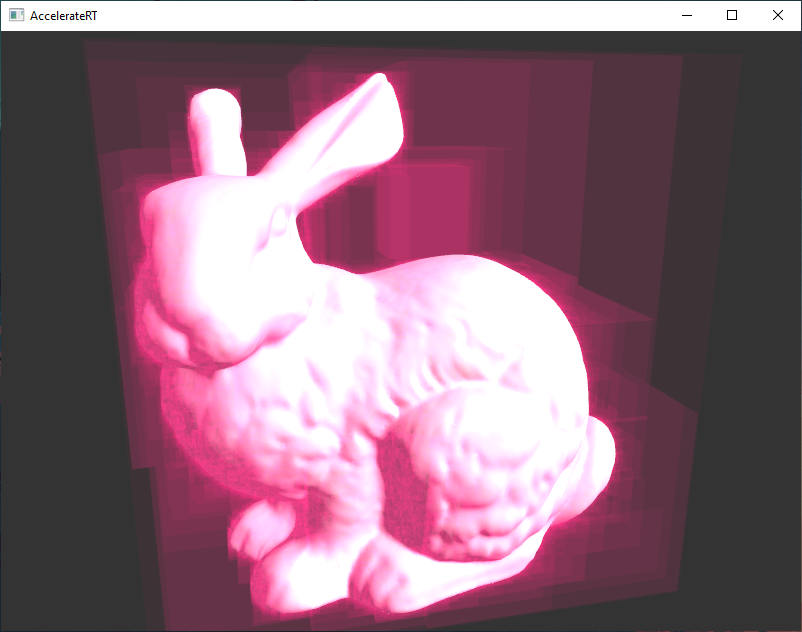

# AccelerateRT
Explore acceleration structures (BVHs) for ray tracing.  
Final project for Duke University CS634: Geometric Algorithms.

------

### Project Setup

First make sure you have [Julia](https://julialang.org/) language installed.  
Then install project dependencies locally from command line:
```
>> julia
               _
   _       _ _(_)_     |  Documentation: https://docs.julialang.org
  (_)     | (_) (_)    |
   _ _   _| |_  __ _   |  Type "?" for help, "]?" for Pkg help.
  | | | | | | |/ _` |  |
  | | |_| | | | (_| |  |  Version 1.7.0 (2021-11-30)
 _/ |\__'_|_|_|\__'_|  |  Official https://julialang.org/ release
|__/                   |

julia> ]
(@v1.7) pkg> activate .
(AccelerateRT) pkg> instantiate
julia> exit()
```

------

### BVH Construction

Commands

```
>> julia .\construct.jl -h
usage: construct.jl [--algMiddle] [--algMedian] [--algSAH] [--algSAHM]
                    [--save] [--skip] [--show] [-h] model

positional arguments:
  model        obj model path

optional arguments:
  --algMiddle  construct simple BVH with middle criteria
  --algMedian  construct simple BVH with media criteria
  --algSAH     construct BVH with SAH
  --algSAHM    construct BVH with modifed SAH (new algorithm)
  --save       save constructed structure
  --skip       skip existing structure
  --show       print structure
  -h, --help   show this help message and exit
```

For example, following command constructs simple BVH with median criteria for `bunny` model.  
Saving the computed structure at the end into `structures` folder.
```
>> julia .\construct.jl .\models\bunny\bunny.obj --algMedian --save
```

------

### Visualization

Commands

```
>> julia .\visualize.jl -h
usage: visualize.jl [--bvh BVH] [-h] model

positional arguments:
  model       obj model path

optional arguments:
  --bvh BVH   constructed BVH path
  -h, --help  show this help message and exit
```

For example, following command visualizes `teapot` model in an interactive environment.
```
>> julia .\visualize.jl .\models\teapot\teapot.obj
```

The following command visualizes `bunny` model and its precomputed BVH structure.
```
>> julia .\visualize.jl .\models\bunny\bunny.obj --bvh .\structures\__models_bunny_bunny_obj.median.jld2
```



------

### Benchmark

Commands
```
>> julia .\benchmark.jl -h
usage: benchmark.jl [--seed SEED] [--samples SAMPLES]
                    [--resolution RESOLUTION] [--skip] [-h]

optional arguments:
  --seed SEED           random seed (type: Int64, default: 0)
  --samples SAMPLES     number of random samples (type: Int64,     
                        default: 100)
  --resolution RESOLUTION
                        screen resolution (in format WxH) (default:
                        "50x50")
  --skip                whether to skip existing benchmark caches  
  -h, --help            show this help message and exit
```

By default, `benchmark.jl` distributes workers to all cores available. Modify `ParallelCores` variable to change this behavior: `0` for all cores, `1` for single-process, else customized number of workers.

More info can be found in `benchmark_notebook.jl` notebook, or by opening `benchmark_notebook.jl.pdf` file.  
To execute it:  
```
>> julia
julia> import Pluto
julia> Pluto.run()
```
And open `benchmark_notebook.jl` in browser.  
To see the code only, open `benchmark_notebook.jl` in a text editor.  

